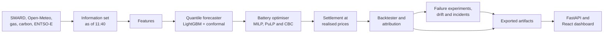

# Day-Ahead Electricity Price Forecasting and Battery Trading (DE-LU)

A probabilistic price forecaster feeding a battery dispatch optimiser, backtested on real German day-ahead market data. Built to answer one question: does a better price forecast actually make a battery more money?

**The finding.** Trading a 1 MW / 2 MWh battery on two years of DE-LU day-ahead prices, my quantile forecast captured 90.1% of the perfect-foresight profit, €74,700 per MW per year, against 77.6% when the same optimiser traded on yesterday's prices. Better forecasts earned more, a rank correlation of -0.83 across eight forecasters, but timing mattered more than size: an evening shifted one hour early lost as much as random noise with twice the average error. What binds is the forecast, not the battery: forecast error cost 9.9% of the achievable profit, while lifting the two-cycle warranty cap would have added only 0.7%. For an operator, the next euro belongs in evening timing and drift monitoring: on an untouched summer hold-out, capture came in 3.4 points below the same months of validation because the forecast degraded.


*My dashboard on 14 September 2026, the last hold-out day: the forecast issued at 11:40 the day before topped out at €198/MWh and missed the €740/MWh evening peak, yet the schedule solved for a 1 MW / 2 MWh battery earned €964, 93.3% of the €1,034 perfect foresight made. Every control reads backtest results for 835 days.*

## What's in the system

| Component | What it does | Method |
|---|---|---|
| Data pipeline | DE-LU prices, load, wind and solar at 15-minute resolution; weather forecasts, gas, carbon, imbalance prices | SMARD, Open-Meteo, Yahoo TTF, EEX, ENTSO-E API |
| Price forecaster | Quantiles q05 to q95 for every quarter-hour of the next day, issued at 11:40 | LightGBM with conformal ranges, chosen from eight models |
| Battery optimiser | Charge and discharge schedule for one delivery day | MILP in PuLP with CBC, wear cost, two-cycle cap |
| Backtester | Walk-forward over two years, profit against perfect foresight, one frozen hold-out | Daily re-solve, Shapley attribution, block bootstrap |
| Model health | Failure experiments measured in euros: a price regime shift, drift, a missing weather feed and the 12:00 deadline; an incident log | Walk-forward reruns, rolling alerts with thresholds fixed on validation, a fallback chain |
| Dashboard | Forecast fan, calibration, error by hour, the day's schedule, cumulative profit for any battery from 0.5 to 5 MW and 1 to 4 hours, and a Model health tab | React and FastAPI over exported backtest results; one day's schedule solved on request |

## Results

### Forecast quality

Validation window, June 2024 to May 2026, 70,080 quarter-hours.

| Model | Pinball loss | 90% interval coverage | MAE on median (€/MWh) |
|---|---|---|---|
| Seasonal naive (same quarter-hour, last week) | 11.49 | 85.4% | 35.34 |
| Naive (same quarter-hour, yesterday) | 9.61 | 86.4% | 29.05 |
| LEAR (regularised linear model) | 8.06 | 84.9% | 24.59 |
| Quantile forest | 5.18 | 94.6% | 16.80 |
| LightGBM quantile (raw) | 5.00 | 73.3% | 15.43 |
| **LightGBM + conformal (production)** | **5.11** | **85.6%** | **16.03** |
| LightGBM + conformal, hold-out June to September 2026 | 6.95 | 77.8% | 20.24 |


The production model is close to calibrated with slightly narrow tails: its 90% range covered 85.6% of prices, against 73.3% for raw LightGBM quantile. It is weakest on extremes: pinball loss rises to 8.20 on days above €200/MWh, and its range did not reach the -€500/MWh floor on 1 May 2026.

### Trading performance

1 MW / 2 MWh, 90% round trip, €8 wear per MWh discharged, at most two cycles a day. Schedules are committed before the 12:00 gate and settled at the realised price.

| Strategy | Annual P&L net of wear (€/MW) | Capture vs perfect foresight | Cycles/day | Max drawdown (€) | Hold-out capture |
|---|---|---|---|---|---|
| Perfect foresight (upper bound) | 82,961 | 100% | 1.74 | 0 | 100% |
| Median-forecast dispatch | 74,749 | 90.1% | 1.73 | 30 | 91.0% |
| Mean-forecast dispatch | 74,762 | 90.1% | 1.76 | 24 | 90.7% |
| Quantile-aware dispatch, q25 | 70,752 | 85.3% | 1.25 | 26 | 88.8% |
| Median dispatch on a naive forecast (yesterday's prices) | 64,418 | 77.6% | 1.73 | 174 | 84.0% |


*One validation day: the quantile forecast issued at 11:40 the day before, and the schedule the optimiser committed before the 12:00 gate.*

I froze every choice on the validation window before trading the hold-out, 1 June to 14 September 2026, once. Against the same summer months of validation, 94.3%, the hold-out came in 3.4 points lower.

### The decision-value experiment


Better pinball loss mostly means more profit: capture rises from 77.6% for a naive forecast to 90.9% for QRA. Among the four most accurate models, capture differs by only 2.1 points and does not follow the accuracy order. Synthetic forecasts show why: with the same €16/MWh average error, a level shift lost €44 over two years and random noise €24,800, while pulling the evening one hour early lost €24,800 with an error of only €7/MWh.

### Model health

I broke the pipeline on purpose and measured what it cost.


*The Model health tab: rolling 90% coverage through the 2021 to 2023 gas crisis for a model frozen on 2019 to 2020 prices against quarterly and monthly refits, and the drift monitor at the end of the hold-out, 67.5% coverage against its 74.0% alert line.*

- Fitted on 2019 to 2020 and never refitted, the model's 90% range covered 25.7% of prices through the 2021 to 2023 gas crisis and captured 28.9% of perfect foresight. Refitted every 28 days, as in production, it held 80.6% coverage and 80.7% capture.
- My drift monitor, with thresholds fixed on validation, first alerted 31 days into the hold-out on its pinball-loss signal; the coverage signal took 102 days.
- A missing weather feed at 11:40 cost 2.3 capture points, €3,742 over two years; falling back to a model trained without weather cut that to €1,973.
- With pipeline failures injected on 13% of days, my fallback chain still submitted a forecast before the 12:00 gate every day in my simulation, and kept €15,898 that a pipeline without fallbacks, and so without a position on those days, would have lost.

## Three things I learned

- Timing beat accuracy in my backtest: an evening forecast one hour early, with a €7/MWh average error, cost as much as random noise at €16/MWh.
- Days with a negative price were 28% of my trading days but earned 37% of the battery's profit.
- On my hold-out, forecasts too low between 18:00 and 21:00 caused 49% of the shortfall against perfect foresight.

## Limitations

- Day-ahead only: no intraday re-trading and no balancing or reserve revenue.
- One 1 MW battery as a price taker, with fixed-volume orders filled at the clearing price; no fleet, grid or market-impact effects.
- Wear is a flat €8 per MWh discharged with a two-cycle cap, not a cell-ageing model, and each day starts and ends half full.
- Outages sit outside the headline numbers. Settled at the German imbalance price, a random two-hour outage costs €44 on average, the worst window of a day €277.
- The hold-out is 105 summer days and public data has gaps. Failure rates in the deadline simulation are assumptions, not measured outages.
- Not a trading recommendation.

A production system would add a live pipeline, intraday re-optimisation and bid curves. Phase 7 adds the scheduled pipeline.

## Architecture



```
config/settings.yaml     market, data sources, hold-out, battery, strategies
src/ingest/              SMARD, Open-Meteo, fuel and ENTSO-E clients, data-quality checks
src/features/            features built only from what is known at 11:40
src/forecasting/         information set, walk-forward harness, eight models, hold-out runner
src/trading/             battery, MILP optimiser, settlement, strategies, backtest, attribution
src/health/              drift monitor, incident log and failure experiments (M1, M2, M3, T4, D1, D5)
src/export/              dashboard artifacts: forecasts, P&L grid, attribution
api/                     read-only FastAPI service behind the dashboard
frontend/                React, TypeScript and recharts dashboard
notebooks/               builders for the evaluation notebooks and README figures
tests/                   network-free tests, including DST days, leakage and toy MILPs
docs/                    data guide, production notes, results, figures, dashboard mockup
```

## Reproduce it

Requires Python 3.11 and [uv](https://docs.astral.sh/uv/); the dashboard also needs Node.js 20.19 or newer.

```bash
make setup      # uv sync --extra dev --extra eda
make data       # SMARD prices, load and generation; weather forecasts; gas and carbon
make entsoe     # optional: ENTSO-E price cross-check and imbalance prices
make forecast   # baselines and the eight-model walk-forward comparison
make backtest   # battery strategies, backtest suites, outage stress test
make holdout    # hold-out forecasts and backtest; runs once, refuses a second run
make report     # results report and evaluation notebooks
make figures    # README figures
make export     # dashboard artifacts, including the P&L grid for 104 battery settings
make experiments # Phase 6 failure experiments: regime shift, missing weather, deadline, drift
make health     # drift monitor and incident log from saved forecasts
make mlflow     # browse the recorded experiment runs at http://127.0.0.1:5001
make dashboard  # build the React app and serve it with the API at http://127.0.0.1:8000
make test       # ruff, strict mypy, pytest
```

SMARD and Open-Meteo need no key. For ENTSO-E, register on the [Transparency Platform](https://transparency.entsoe.eu), email transparency@entsoe.eu asking for Restful API access, generate a token in your account settings and put `ENTSOE_API_KEY=<token>` in a gitignored `.env` file at the repository root. Downloads land in `data/raw/` and `data/processed/`, which are not committed.

On an Apple M2 Pro with 10 cores, the eight-model comparison takes 88 minutes, the five validation backtest suites 17, and the hold-out forecasts 5.

| Source | Used for | Licence |
|---|---|---|
| [SMARD.de](https://www.smard.de), Bundesnetzagentur | DE-LU day-ahead prices; load, wind and solar | CC BY 4.0 |
| [Open-Meteo](https://open-meteo.com) Previous Runs API | Weather forecasts issued two days ahead, 12 German points | CC BY 4.0; free API for non-commercial use |
| Yahoo Finance, ticker TTF=F | Daily Dutch TTF gas settlement | Yahoo terms, personal use; not redistributed |
| [EEX](https://www.eex.com) EU ETS primary auctions | Daily carbon allowance price | EEX public reports; not redistributed |
| [ENTSO-E Transparency Platform](https://transparency.entsoe.eu) | Price cross-check; German imbalance prices | Platform terms of use; not redistributed |

Data: Bundesnetzagentur | SMARD.de, and weather data by Open-Meteo.com, both licensed under [CC BY 4.0](https://creativecommons.org/licenses/by/4.0/).

## Background reading

The reasoning and evidence behind each choice, written while building this: [the data guide](docs/data_guide.md), [the production notes](docs/production_notes.md) with a measured result for each failure mode, [the model comparison](notebooks/model_comparison.ipynb), [the backtest notebook](notebooks/backtest_report.ipynb) and [the full results](docs/results/).

## About me

**Hasan Rafiq.** PhD in Electrical Engineering, 9+ years of applied machine learning in energy, with production experience in load and generation forecasting, battery dispatch optimisation, fault detection & diagnosis, and asset health monitoring. [LinkedIn](https://www.linkedin.com/in/rafiqh)

