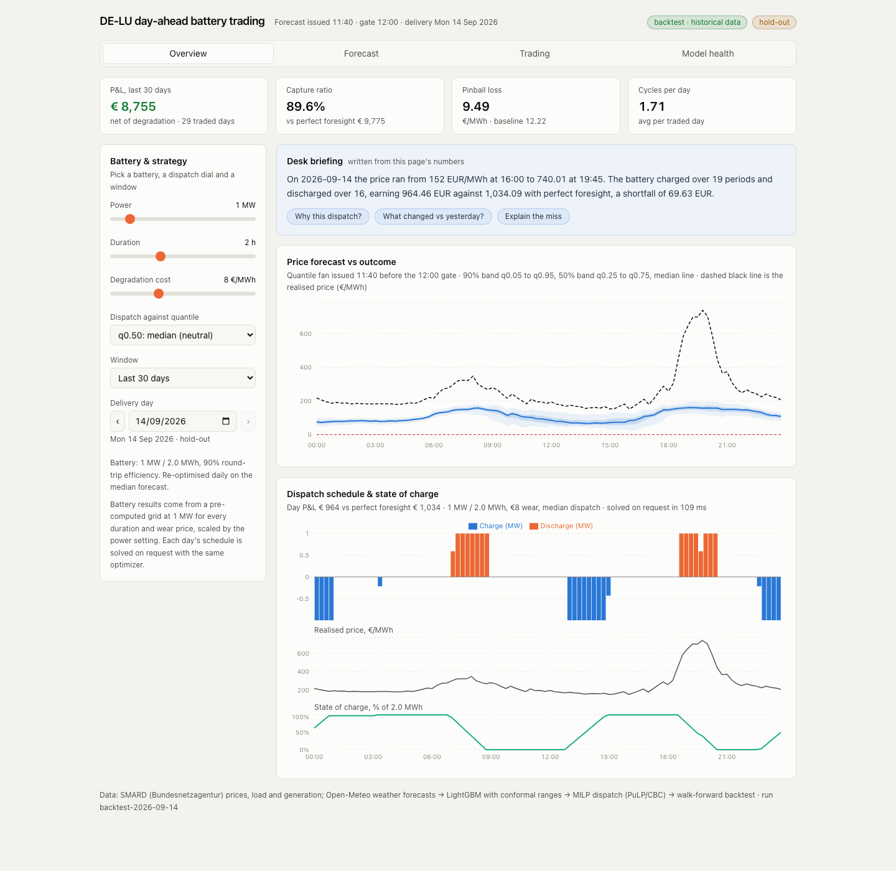
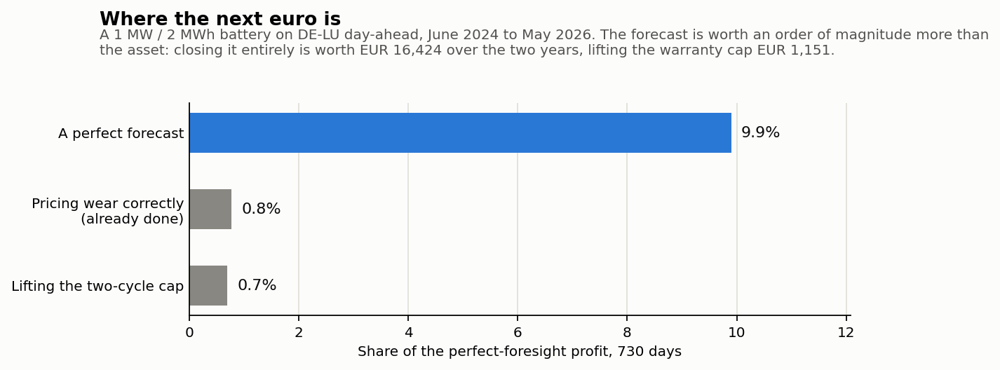
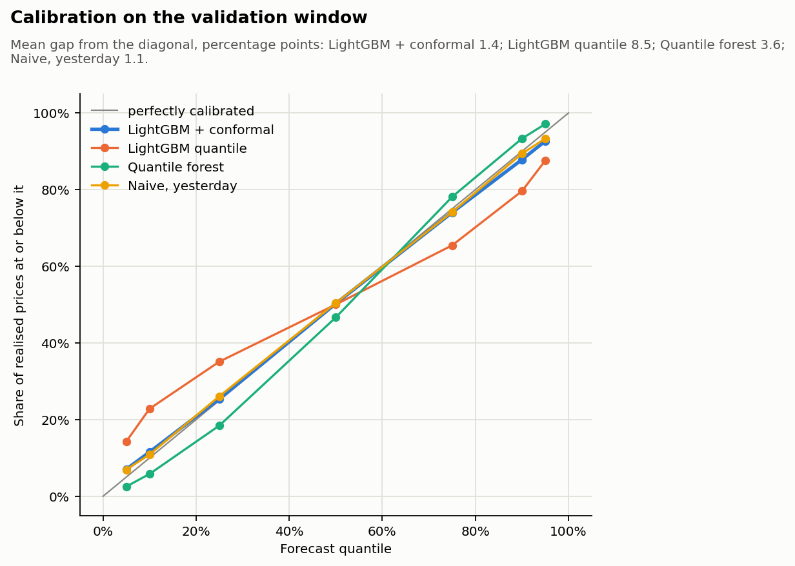
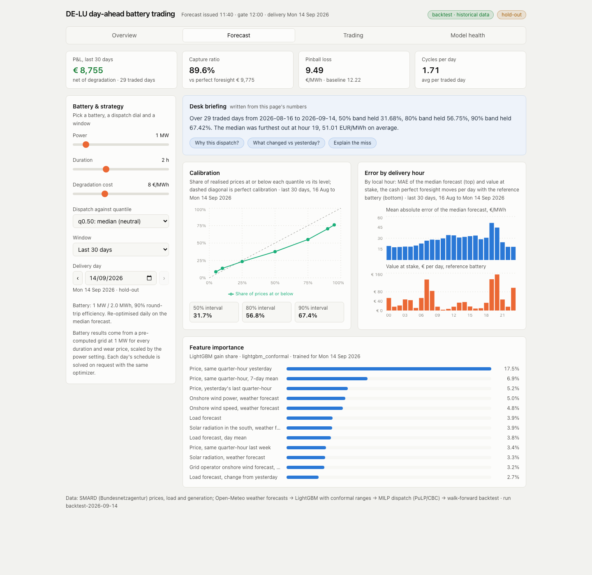
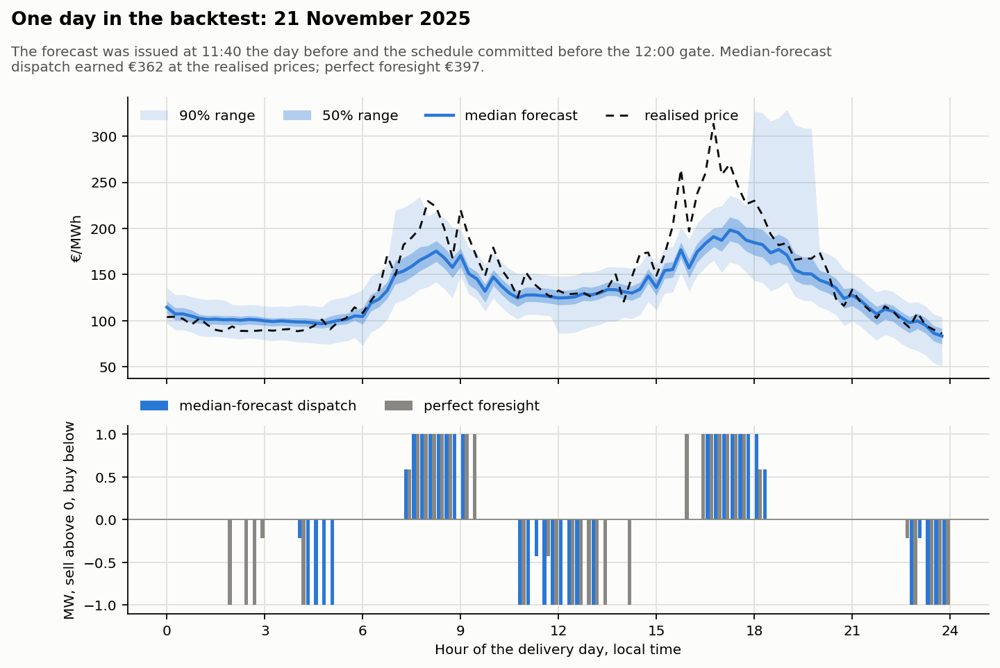
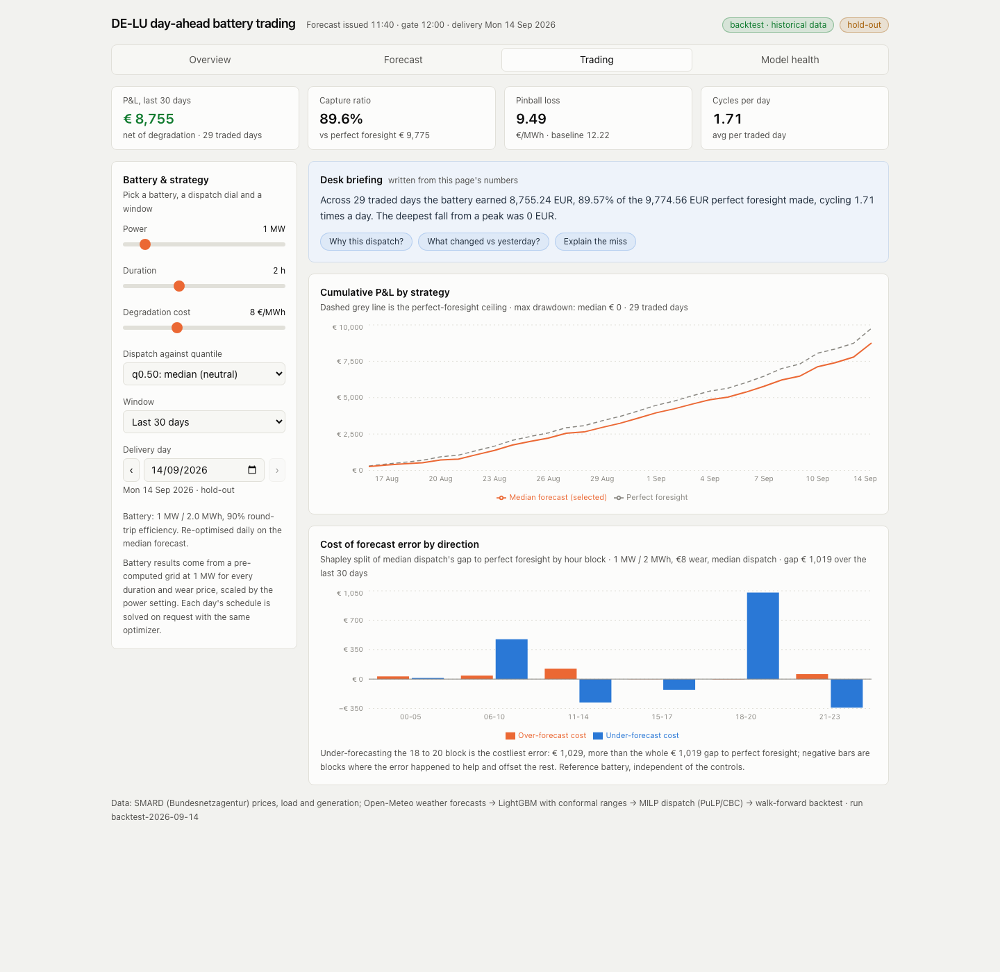
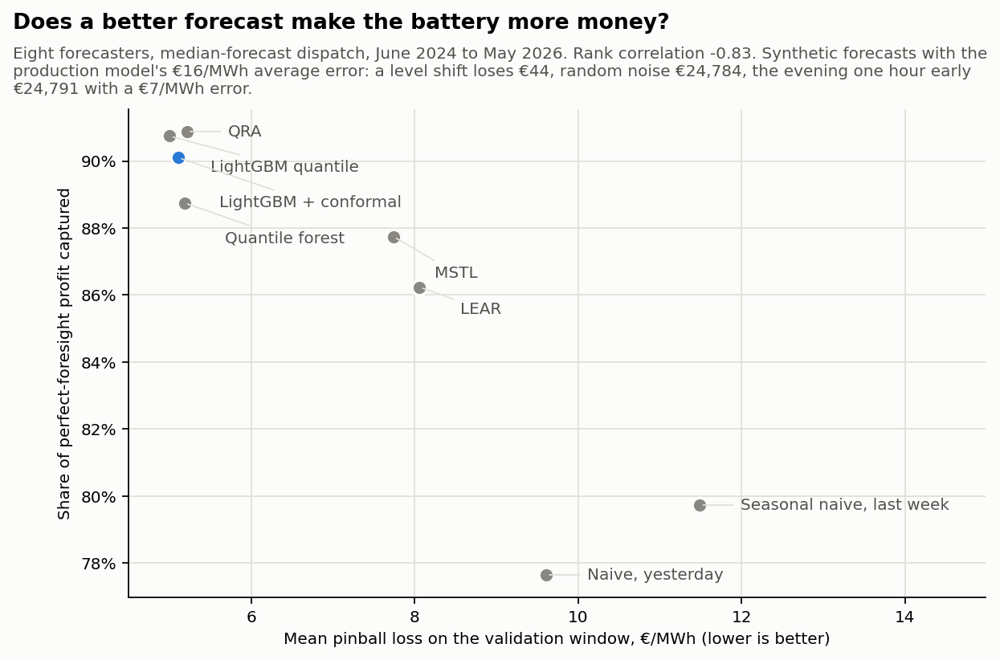
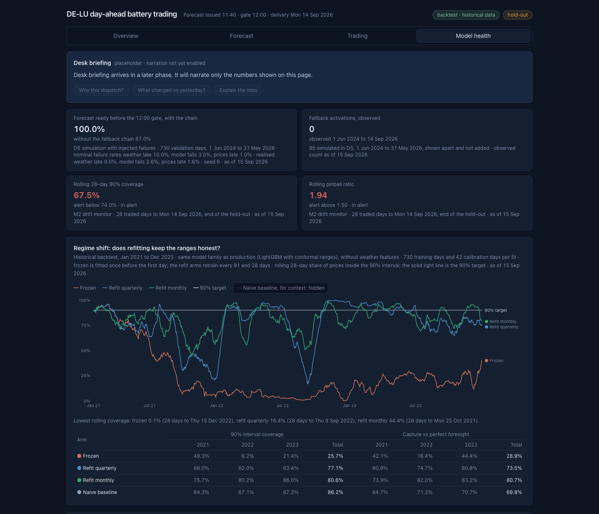
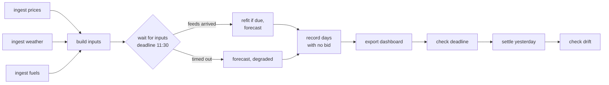
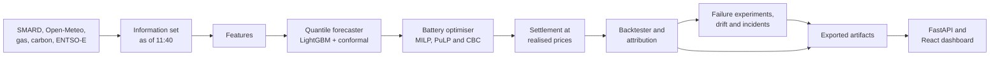

# Day-Ahead Electricity Price Forecasting and Battery Trading (DE-LU)

A probabilistic price forecaster feeding a battery dispatch optimiser, backtested on real German day-ahead market data. Built to answer one question: does a better price forecast actually make a battery more money?

**The finding.** Trading a 1 MW / 2 MWh battery on two years of DE-LU day-ahead prices, my quantile forecast captured 90.1% of the perfect-foresight profit, €74,700 per MW per year, against 77.6% when the same optimiser traded on yesterday's prices. Better forecasts earned more, a rank correlation of -0.83 across eight forecasters, but timing mattered more than size: an evening shifted one hour early lost as much as random noise with twice the average error. What binds is the forecast, not the battery: measured the same way, as what this battery trading on this forecast would gain, closing the forecast gap is worth 9.9% of the achievable profit and lifting the two-cycle warranty cap 0.1%. For an operator, the next euro belongs in evening timing and drift monitoring: on an untouched summer hold-out, capture came in 3.4 points below the same months of validation because the forecast degraded.



*My dashboard on 14 September 2026, the last hold-out day: the forecast issued at 11:40 the day before topped out at €198/MWh and missed the €740/MWh evening peak, yet the schedule solved for a 1 MW / 2 MWh battery earned €964, 93.3% of the €1,034 perfect foresight made. Every control reads backtest results for 835 days. The panel above the chart is the desk briefing, written from the same numbers the page shows.*

## What's in the system

| Component | What it does | Method |
|---|---|---|
| Data pipeline | DE-LU prices, load, wind and solar at 15-minute resolution; weather forecasts, gas, carbon, imbalance prices | SMARD, Open-Meteo, Yahoo TTF, EEX, ENTSO-E API |
| Price forecaster | Quantiles q05 to q95 for every quarter-hour of the next day, issued at 11:40 | LightGBM with conformal ranges, chosen from eight models |
| Battery optimiser | Charge and discharge schedule for one delivery day | MILP in PuLP with CBC, wear cost, two-cycle cap |
| Backtester | Walk-forward over two years, profit against perfect foresight, one frozen hold-out | Daily re-solve, Shapley attribution, block bootstrap |
| Model health | Failure experiments measured in euros: a price regime shift, drift, a missing weather feed and the 12:00 deadline; an incident log | Walk-forward reruns, rolling alerts with thresholds fixed on validation, a fallback chain |
| Live pipeline | A daily run that forecasts tomorrow, commits a schedule before the 12:00 gate and settles it the next day | GitHub Actions on a schedule, or the same steps as an Airflow DAG; readiness sensor with a deadline, fallback chain with a time limit on every step, MLflow model registry refit every 28 days, a daily drift check, state kept on its own branch |
| Dashboard | Forecast fan, calibration, error by hour, the day's schedule, cumulative profit for any battery from 0.5 to 5 MW and 1 to 4 hours, a Model health tab, and a Live tab with every day the pipeline traded | React and FastAPI over exported backtest results; one day's schedule solved on request |
| Desk briefing | Three to five sentences about the tab you are on, and three follow-up questions | A deterministic writer over that page's own numbers; a language model can be switched on, with every figure it writes checked against them before it is shown |

## Results

### Forecast quality

Validation window, June 2024 to May 2026, 70,080 quarter-hours.

| Model | Pinball loss | 90% interval coverage | MAE on median (€/MWh) |
|---|---|---|---|
| Seasonal naive (same quarter-hour, last week) | 11.49 | 85.4% | 35.34 |
| Naive (same quarter-hour, yesterday) | 9.61 | 86.4% | 29.05 |
| LEAR (regularised linear model) | 8.06 | 84.9% | 24.59 |
| Quantile forest | 5.18 | 94.6% | 16.80 |
| LightGBM quantile (raw) | 5.00 | 73.3% | 15.43 |
| **LightGBM + conformal (production)** | **5.11** | **85.6%** | **16.03** |
| LightGBM + conformal, hold-out June to September 2026 | 6.95 | 77.8% | 20.24 |



*Every bar is the same quantity: what the median-forecast strategy would have gained over the same 730 days, as a share of the perfect-foresight ceiling. Closing the forecast gap is worth €16,424 over the two years; lifting the two-cycle warranty cap, €223. Measuring the cap against the ceiling instead answers a different question, what a trader with perfect knowledge would gain from it, and that figure is €1,151.*



The production model is close to calibrated with slightly narrow tails: its 90% range covered 85.6% of prices, against 73.3% for raw LightGBM quantile. It is weakest on extremes: pinball loss rises to 8.20 on days above €200/MWh, and its range did not reach the -€500/MWh floor on 1 May 2026.



*The Forecast tab: calibration against the diagonal, error and money at stake by delivery hour, and what the model leans on. Over the 29 traded days to 14 September 2026 the 50% band held 31.7% of prices, the 80% band 56.8% and the 90% band 67.4%, so the ranges ran narrow at the end of the hold-out. Yesterday's price for the same quarter-hour carries 17.5% of the model's gain.*

### Trading performance

1 MW / 2 MWh, 90% round trip, €8 wear per MWh discharged, at most two cycles a day. Schedules are committed before the 12:00 gate and settled at the realised price.

| Strategy | Annual P&L net of wear (€/MW) | Capture vs perfect foresight | Cycles/day | Max drawdown (€) | Hold-out capture |
|---|---|---|---|---|---|
| Perfect foresight (upper bound) | 82,961 | 100% | 1.74 | 0 | 100% |
| Median-forecast dispatch | 74,749 | 90.1% | 1.73 | 30 | 91.0% |
| Mean-forecast dispatch | 74,762 | 90.1% | 1.76 | 24 | 90.7% |
| Quantile-aware dispatch, q25 | 70,752 | 85.3% | 1.25 | 26 | 88.8% |
| Median dispatch on a naive forecast (yesterday's prices) | 64,418 | 77.6% | 1.73 | 174 | 84.0% |



*One validation day: the quantile forecast issued at 11:40 the day before, and the schedule the optimiser committed before the 12:00 gate.*



*The Trading tab: profit against the perfect-foresight ceiling, and where the forecast error cost money. Over the last 29 traded days the battery earned €8,755 of the €9,775 available, 89.6%, with no drawdown. Under-forecasting the 18:00 to 20:00 block cost €1,029, more than the whole €1,019 gap to perfect foresight, because the other blocks handed some of it back.*

I froze every choice on the validation window before trading the hold-out, 1 June to 14 September 2026, once. Against the same summer months of validation, 94.3%, the hold-out came in 3.4 points lower.

Where the money is lost: about 40% of the gap to perfect foresight falls between 15:00 and 21:00 local time. Within that window the loss sits later in summer, so the 18:00 to 21:00 evening block takes 35% of the summer gap but only 16% in winter. Anchoring the window to sunset instead of the clock explains no measurably more of the loss. Reading the two schedules inside that window, the cash they trade there cannot be told apart. The window's cost sits where the forecast came in below the outcome, 89% of it, while the battery reaches 15:00 slightly fuller than perfect foresight, so a charge reserve would not target it. The cheapest dispatch-side correction, valuing sales in that window at the forecast's q75, was tested against a bar fixed before the run and rejected: the daily profit difference against median dispatch was -€2.59 (95% interval -3.95 to -0.89), because cash after 21:00 fell by most of what the window gained and cash in the morning and at midday fell too.

### The decision-value experiment



Better pinball loss mostly means more profit: capture rises from 77.6% for a naive forecast to 90.9% for QRA. Among the four most accurate models, capture differs by only 2.1 points and does not follow the accuracy order. Synthetic forecasts show why: with the same €16/MWh average error, a level shift lost €44 over two years and random noise €24,800, while pulling the evening one hour early lost €24,800 with an error of only €7/MWh.

So I tried the other direction: training the forecaster on the money. Keeping the production model as a fixed base, 100 extra trees are trained on a loss that rewards the battery's profit rather than the price error (SPO+, Elmachtoub and Grigas 2022), with the optimiser's linear relaxation solved 70,000 times per fit. Against a bar fixed before the run, on the 730 validation days it earned €2.93 a day more than median dispatch (95% interval +1.53 to +4.74), €2,138 over two years and 1.3 capture points, with the point's accuracy unchanged at 16.0 €/MWh: the corrections raise the morning and evening by about €1 and lower the night by about €1. The honest caveats: the ten best days carry 58% of the gain, two dark winter days a third, and 2025 alone only just clears zero. Checked afterwards: a cheap hour-of-day bias correction lost money, and other seeds gave the same result. The live pipeline still trades the median forecast.

Two more experiments then went after the evening loss from the forecasting side, each with its pass mark fixed before the run, and both failed it. Nine columns saying why an evening spikes (evening load and its ramp, afternoon solar, evening wind, residual load, recent spikes) changed profit by -€0.76 a day (95% interval -1.97 to +0.52): the model could already see a tight evening coming and still guessed low, because a model trained for average accuracy hedges. A separate model of the chance that the evening reaches €200 was good (AUC 0.91; of the days it put above 70%, 84% spiked) but betting on it in the dispatch, by raising the evening valuation or by holding the battery full for 17:00, earned nothing measurable (-€0.65 and +€0.27 a day, both within noise): when a spike is visible the optimiser already holds charge for it, and the money sits in which quarter-hour the peak lands. The three together say the evening loss is not a shortage of day-level signals about whether the evening will be tight, nor a confidence problem; what is left is consistent with timing within the evening on spike days, and moving it would take a forecast of the peak's shape, quarter-hour by quarter-hour. The plans, written before each run, are in `docs/plans/`.

### Model health

I broke the pipeline on purpose and measured what it cost.



*The Model health tab: rolling 90% coverage through the 2021 to 2023 gas crisis for a model frozen on 2019 to 2020 prices against quarterly and monthly refits, and the drift monitor at the end of the hold-out, 67.5% coverage against its 74.0% alert line.*

- Fitted on 2019 to 2020 and never refitted, the model's 90% range covered 25.7% of prices through the 2021 to 2023 gas crisis and captured 28.9% of perfect foresight. Refitted every 28 days, as in production, it held 80.6% coverage and 80.7% capture.
- Refitting weekly instead of every 28 days cut mean pinball loss by 2.1%, in the evening peak as much as elsewhere, but brought no measurable gain in profit over two years of validation: €327 more, well inside the noise. The live pipeline keeps the 28-day cadence the backtests used.
- My drift monitor, with thresholds fixed on validation, first alerted 31 days into the hold-out on its pinball-loss signal; the coverage signal took 102 days.
- A missing weather feed at 11:40 cost 2.3 capture points, €3,742 over two years; falling back to a model trained without weather cut that to €1,973.
- With pipeline failures injected on 13% of days, my fallback chain still submitted a forecast before the 12:00 gate every day in my simulation, and kept €15,898 that a pipeline without fallbacks, and so without a position on those days, would have lost.

### The daily pipeline

The same code that ran the backtest runs as a daily job. At 10:30 it refreshes the
feeds, waits for tomorrow's load forecast and weather, forecasts at 11:40 and commits
a schedule before the 12:00 gate. The next day it settles what it committed, once the
auction has published the prices, and runs the drift monitor on the settled record.



- **A late feed does not stop the bid.** The chain steps down from the production
  model to a model without weather, then seasonal naive, then yesterday's prices, and
  writes an incident saying which step ran and when the forecast went out.
- **The model comes from the MLflow registry,** so the pipeline serves a version that
  was trained and logged deliberately, not one fitted on the spot.
- **The model is refit every 28 days, as in the backtests.** Before a day is forecast,
  if the served version first forecast 28 or more days earlier, a new model is fit for
  that day, must forecast it with finite quantiles, and is registered as the new
  production version.
  A refit waits for a day with every feed, and one that fails leaves the served
  version in place and writes an incident, so it never blocks the bid.
- **A hung model cannot hold the gate.** Every fit and every rung of the chain has a
  120-second limit against the 8 seconds a fit takes on the laptop that registered
  the model; a hosted runner is slower and the limit has not yet been measured
  against one, because no refit has fallen due there. A step still running is
  abandoned and the chain moves on. The registry calls and file reads around them have
  no limit of their own, and only the forecast task's 15-minute timeout covers them.
- **A live day cannot be settled when it is traded,** so the run commits a plan and a
  separate step values it once prices publish.
- **The dashboard's Live tab shows the record as it grows:** each delivery day's
  bid time against the gate, which rung of the chain forecast it, the planned value
  against what settled, cycles, incidents, and the drift monitor's warm-up count.
- **The desk runs on GitHub Actions, not on a laptop.** A scheduled workflow bids
  three times each morning, at 07:30, 08:15 and 09:00 UTC, the last of which is still
  an hour before the 12:00 Berlin gate at its earliest in UTC. Three, because a
  scheduled run is not a promise: GitHub delays them under load and drops them
  outright, and this workflow's own first two never started. Nothing reports that
  either, since the failure issue and the incident log both need a run to be running
  before they can say anything, so repetition is the defence rather than an alarm.
  The extra attempts are nearly free: the pipeline refuses a day that already has a
  committed schedule, so whichever attempt arrives first is the bid and the rest exit
  at the guard. It shells into the same modules the Airflow
  DAG does, with one difference: it does not export the dashboard, which is built on a
  machine that holds the backtest artifacts. It needs no secrets (SMARD, Open-Meteo and
  the fuel prices are all keyless), and opens an issue when it fails. The state the desk must remember, about
  7 MB of run records, plans, settlements, saved forecasts, incidents and the model
  registry, is checked out from a `live-state` branch before the run and committed
  back after it, so the time each bid was made is in a commit rather than only in a
  file. The market data is not carried: it is rebuilt from source on every run, and
  only as far back as the run needs. A laptop pays for the years of history once and
  keeps the cache; a runner holds none, so it would pay again on every run. The
  window is computed from what the day actually reads: the drift monitor's lookback,
  the furthest back any rung of the fallback chain reaches, the model's own feature
  history, and on the one day in 28 that a refit falls due, the whole two-year
  training window. An ordinary run downloads 86 days instead of eight years, and a
  windowed download never shortens a dataset that is already longer.
- **The interpreter is pinned, because the model is a pickle.** The registered
  model holds objects backed by native extensions, and unpickling one under a
  different Python minor version does not raise: it segmentation faults, and a
  process that dies at that level writes no incident and leaves nothing but an exit
  code. The first scheduled run hit exactly that, on Python 3.12 against a model
  registered under 3.11. `.python-version` now pins it and the workflow reads the
  same file, and the loader refuses a model whose recorded Python differs from the
  running one, before anything is unpickled, so the desk degrades and bids instead
  of dying.
- **A served model that cannot be loaded is an incident, not a substitution.**
  When nothing is registered the chain fits a model on the spot, which is the
  design. When a version *is* registered and will not load, the chain does the same
  thing and the run would otherwise record it as the production model: same step,
  not degraded, nothing said. That now writes a critical incident naming the version
  it could not load. The bid still goes out, because a bid beats no bid.
- **The model registry does not belong to the machine that wrote it.** MLflow records
  absolute paths, so a store restored under another root would send it looking for
  artifacts that are not there, and the chain would quietly fit a model of its own
  and call it the production model. The registry is rewritten on the way out and the
  way back in, which also keeps the home directory of whoever logged the model off a
  public branch. A save reads the whole store for machine paths and refuses rather
  than publishing one.
- **A day the pipeline did not run is shown, not hidden.** A day with no bid has no
  bid whatever the reason, a laptop switched off or a scheduled run that never
  started. Each of those days gets its own incident and its own row, and every figure
  that describes live trading is counted over the days the desk actually bid. A day
  the pipeline ran and failed on is not counted as an outage: that run writes its own
  incident, and it was not the machine that was missing.
- **A missed day can be reconstructed, and a reconstruction never passes for a bid.**
  The same chain can forecast a past day from the data that was available before its
  gate, to show what the model would have bid. It is refused if the registered model
  was fitted after that day, it never refits, it has no issue time and no gate verdict,
  it writes no incident, the drift monitor leaves it out, and the Live tab marks it
  "reconstructed". It does not close the day's gap: the battery still traded nothing.
- **The drift monitor runs on the live record,** with the thresholds fixed on
  validation: rolling 28-day 90% coverage below 74% or pinball loss above 1.5 times its
  validation median. It scores only settled days the production model forecast, needs
  28 of them before it can alert, and raises a drift incident for retraining review; it
  does not refit early.
- **The hold-out stays frozen:** the pipeline refuses any delivery day before
  `live_from`, the day after the hold-out was last scored.

**What the first runs did.** On 16 September 2026 every feed was published, the
pipeline served the model registered as version 1 and committed a schedule worth
€289, which settled at €308. The run for 17 September reported the load forecast and
weather missing and fell back to seasonal naive. Those first two runs were made by hand
after the gate and are recorded as late. The run for 18 September went out at 11:34
Berlin, 26 minutes before the gate, still on the fallback and planned at €324. It hit
the same 0 of 96 while SMARD already held all 96 quarter-hours of that day's load
forecast, which exposed the cause: the dataset build trimmed every row after the last
published price, and on a live day that is the whole day being forecast. A live build
now keeps the delivery day's rows with the price left blank, the readiness check
rebuilds its inputs each time it polls, and a rerun never replaces a committed
schedule.

The machine was then off from 18 to 20 September. A bid for delivery day D is made
on D-1, so delivery days 19, 20 and 21 September were never bid, and all three are
recorded as outages. The 19th and 20th were reconstructed afterwards on version 1,
the model that was already serving on those days: planned €330 and €253, worth €220
and €84 at the published prices. Neither counts in the live totals, and the Live tab
marks them "reconstructed"; the 21st, which has no forecast at all, is marked "desk
offline". The run for 22 September went out at 11:53 Berlin, six minutes before the
gate, on the production model with all four feeds complete, and settled at €870
against a plan of €453.

**What moving to a scheduler cost.** The desk moved to GitHub Actions on 21
September. Its first run bid nothing, because the day already had a schedule and the
pipeline refused to replace it: that proved the plumbing and, precisely because it
stopped at the guard, proved nothing about loading the model. The first run that had
to bid died with exit code 139, a segmentation fault rather than an error, because
the model was pickled under Python 3.11 and the runner resolved 3.12. Nothing in the
log said so beyond a warning MLflow printed while the load was already under way, and
a process that dies at that level writes no incident: the run committed a settlement
and a drift check, because those run whatever happened, and left no schedule, no run
record and no forecast. The bid for 23 September was made from the laptop instead, at
11:29 Berlin, half an hour before the gate.

Neither scheduled attempt that morning started at all. Nothing reported that either,
and nothing could: the failure issue and the incident log both need a run to be
running before they can say anything, so a schedule that does not fire is silent by
construction. The interpreter is now pinned, the loader refuses a model recorded
against a different Python before it can be unpickled, and there are three scheduled
attempts instead of one. What remains uncovered is a morning when all three are
dropped, which only a watcher outside GitHub would catch.

Run it without Airflow with `make pipeline DAY=2026-09-17`, or start the scheduler
with `make airflow`.

## Three things I learned

- Timing beat accuracy in my backtest: an evening forecast one hour early, with a €7/MWh average error, cost as much as random noise at €16/MWh. Turned around, a forecaster trained on the battery's profit instead of its error earned 1.4% more with the same accuracy.
- Days with a negative price were 28% of my trading days but earned 37% of the battery's profit.
- On my hold-out, forecasts too low between 18:00 and 21:00 caused 49% of the shortfall against perfect foresight. On validation, telling the model why evenings spike, a model of the chance of a spike, selling that window at q75, and bidding price limits from the fan all left the evening loss where it was: the fix has to name the quarter-hour, not the evening.

## Limitations

- **Day-ahead only:** no intraday re-trading and no balancing or reserve revenue. I looked into adding the intraday leg honestly and stopped: neither SMARD nor the ENTSO-E Transparency Platform publishes a free DE-LU intraday index at quarter-hour resolution. SMARD's wholesale category is day-ahead prices for each bidding zone, and ENTSO-E's A44 returns the two day-ahead auctions, SDAC and the EXAA 10:15 auction, whatever contract or auction parameters I asked for. Simulating intraday without those prices would have meant inventing them.
- **Price taker (T5):** one 1 MW battery with fixed-volume orders filled at the clearing price; no fleet, grid or market-impact effects. Bidding price limits from the forecast's own quantiles instead was tested and rejected: withholding one leg of a paired trade starves the other, and the imbalance charges for undelivered energy (-€44,271 and -€29,563 across the two arms) dwarfed what the limits saved. With those consequences left out the difference is within noise, so it is the pairing that breaks it, not the limits.
- **Wear is a flat €8 per MWh discharged** with a two-cycle cap, not a cell-ageing model, and each day starts and ends half full.
- **Outages sit outside the headline numbers (T4).** Settled at the German imbalance price, a random two-hour outage costs €44 on average, the worst window of a day €277.
- **The hold-out is 105 summer days (T6)** and public data has gaps. Failure rates in the deadline simulation are assumptions, not measured outages.
- **Measured feeds are read at their latest revised values.** SMARD revises actual
  load and generation after publication, and every build downloads whatever is there
  now rather than what stood on the day. The features that use them are lagged, so a
  day's own values are never read, but a backtest and a reconstruction both see
  figures slightly tidier than the desk had. Forecast feeds do not have this problem:
  the weather comes from an archive of forecasts at a fixed lead, and prices are final
  once the auction clears.
- **A scheduled run is not guaranteed to start.** GitHub delays and drops scheduled
  workflows, and a run that never begins writes no incident and opens no issue, so
  nothing inside the system can report it. Three attempts a morning make one drop
  survivable; a morning when all three are dropped would pass unnoticed until someone
  looked.
- **The live model refits on a fixed schedule only.** The drift monitor runs daily on the live record but only flags a retraining review, and it needs 28 production-model days before it can alert, so a sudden jump in price level waits for the next 28-day refit.
- **The desk briefing is written by a template, not a model, by default (M5).** With a model switched on, every figure it writes must appear in the payload the page was built from, and prose that fails gets one rewrite before the template answers. What the check cannot tell is whether a figure is used in the right role: of 20 gpt-4o-mini briefings shown after it, 7 still misstated what a figure meant. A reflection layer with evals could close that gap; I left it out on purpose, because the template says less but everything it says is right.
- Not a trading recommendation.

A production system would add intraday re-optimisation and bid curves on top of what
is here.

## Architecture



```
config/settings.yaml     market, data sources, hold-out, battery, strategies, live refits
src/ingest/              SMARD, Open-Meteo, fuel and ENTSO-E clients, data-quality checks
src/features/            features built only from what is known at 11:40, plus an opt-in group of evening spike drivers
src/forecasting/         information set, walk-forward harness, eight models, hold-out runner
src/trading/             battery, MILP optimiser (with an optional state-of-charge floor) and its HiGHS relaxation, settlement, strategies, backtest, attribution
src/health/              drift monitor, incident log, failure experiments (M1, M2, M3, T4, D1, D5), T1 and T2 follow-ups
src/narration/           the desk briefing: payload, deterministic writer, optional model, grounding check
src/pipeline/            the daily live run: readiness, fallback chain, plan, model registry, refits, drift check
dags/                    the Airflow DAG, thin: every task shells into src/
ops/                     launchd plists for running the DAG from login on a Mac
src/export/              dashboard artifacts: forecasts, P&L grid, attribution
api/                     read-only FastAPI service behind the dashboard
frontend/                React, TypeScript and recharts dashboard
notebooks/               builders for the evaluation notebooks and README figures
tests/                   network-free tests, including DST days, leakage and toy MILPs
docs/                    data guide, production notes, dashboard API contract, experiment plans, results, figures, dashboard mockup
```

## Reproduce it

Requires Python 3.11 and [uv](https://docs.astral.sh/uv/); the dashboard also needs Node.js 20.19 or newer.

```bash
make setup      # uv sync --extra dev --extra eda
make data       # SMARD prices, load and generation; weather forecasts; gas and carbon
make entsoe     # optional: ENTSO-E price cross-check and imbalance prices
make forecast   # baselines and the eight-model walk-forward comparison
make backtest   # battery strategies, backtest suites, outage stress test
make holdout    # hold-out forecasts and backtest; runs once, refuses a second run
make report     # results report and evaluation notebooks
make figures    # README figures
make export     # dashboard artifacts, including the P&L grid for 104 battery settings
make experiments # Phase 6 failure experiments: regime shift, missing weather, deadline, drift
                # the follow-up experiments run one at a time: uv run python -m src.health.experiments.<name>
make health     # drift monitor and incident log from saved forecasts
make mlflow     # browse the recorded experiment runs at http://127.0.0.1:5001
make airflow-setup # create the Airflow environment, once
make airflow    # scheduler and UI at http://127.0.0.1:8080
make pipeline   # one live run without Airflow: make pipeline DAY=2026-09-17
make settle     # value a committed schedule once prices publish: make settle DAY=2026-09-17
make drift      # drift monitor on the live record through a day: make drift DAY=2026-09-17
make gaps       # record the delivery days the desk did not bid on: make gaps DAY=2026-09-21
make backfill   # reconstruct a missed day, marked as a reconstruction: make backfill DAY=2026-09-19
make history DAY=2026-09-23 # days of market history that run needs to download
make state-restore STORE=.live-state # bring the desk's state into a fresh checkout
make state-save STORE=.live-state    # carry it back out after a run
make launchd-install # macOS: switch the daily DAG on, keep Airflow running from login and the Mac awake for the run
make dashboard  # build the React app and serve it with the API at http://127.0.0.1:8000
make test       # ruff, strict mypy, pytest
```

SMARD and Open-Meteo need no key. For ENTSO-E, register on the [Transparency Platform](https://transparency.entsoe.eu), email transparency@entsoe.eu asking for Restful API access, generate a token in your account settings and set it as `ENTSOE_API_KEY` in `.env` at the repository root: copy `.env.example` to `.env` to start, which is gitignored. Downloads land in `data/raw/` and `data/processed/`, which are not committed.

The desk briefing needs no key: a deterministic writer produces it from the page's own numbers, and every test runs that way. To have a model write it instead, set `NARRATION_PROVIDER` to `openai` or `anthropic` and that provider's key (`OPENAI_API_KEY` or `ANTHROPIC_API_KEY`) in the same `.env`, or export them in your shell, which takes precedence over `.env`. A key alone does not switch the model on. Every figure the model writes is checked against the page before it is shown.

On an Apple M2 Pro with 10 cores, the eight-model comparison takes 88 minutes, the five validation backtest suites 17, and the hold-out forecasts 5.

| Source | Used for | Licence |
|---|---|---|
| [SMARD.de](https://www.smard.de), Bundesnetzagentur | DE-LU day-ahead prices; load, wind and solar | CC BY 4.0 |
| [Open-Meteo](https://open-meteo.com) Previous Runs API | Weather forecasts issued two days ahead, 12 German points | CC BY 4.0; free API for non-commercial use |
| Yahoo Finance, ticker TTF=F | Daily Dutch TTF gas settlement | Yahoo terms, personal use; not redistributed |
| [EEX](https://www.eex.com) EU ETS primary auctions | Daily carbon allowance price | EEX public reports; not redistributed |
| [ENTSO-E Transparency Platform](https://transparency.entsoe.eu) | Price cross-check; German imbalance prices | Platform terms of use; not redistributed |

Data: Bundesnetzagentur | SMARD.de, and weather data by Open-Meteo.com, both licensed under [CC BY 4.0](https://creativecommons.org/licenses/by/4.0/).

## Background reading

The reasoning and evidence behind each choice, written while building this: [the data guide](docs/data_guide.md), [the production notes](docs/production_notes.md) with a measured result for each failure mode, [the model comparison](notebooks/model_comparison.ipynb), [the backtest notebook](notebooks/backtest_report.ipynb), [the full results](docs/results/) and [the experiment plans](docs/plans/), each written before its run, though only the bid-curves plan was committed on its own before its code, so it is the one whose ordering the commit history proves.

## About me

**Hasan Rafiq.** PhD in Electrical Engineering, 9+ years of applied machine learning in energy, with production experience in load and generation forecasting, battery dispatch optimisation, fault detection & diagnosis, and asset health monitoring. [LinkedIn](https://www.linkedin.com/in/rafiqh)

Questions, corrections or things I have got wrong are welcome: [hassan.rafiq182@gmail.com](mailto:hassan.rafiq182@gmail.com)

