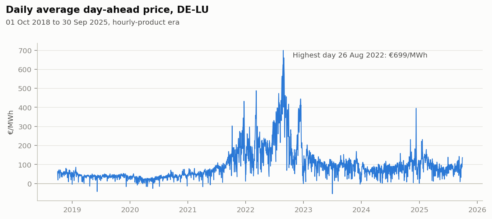
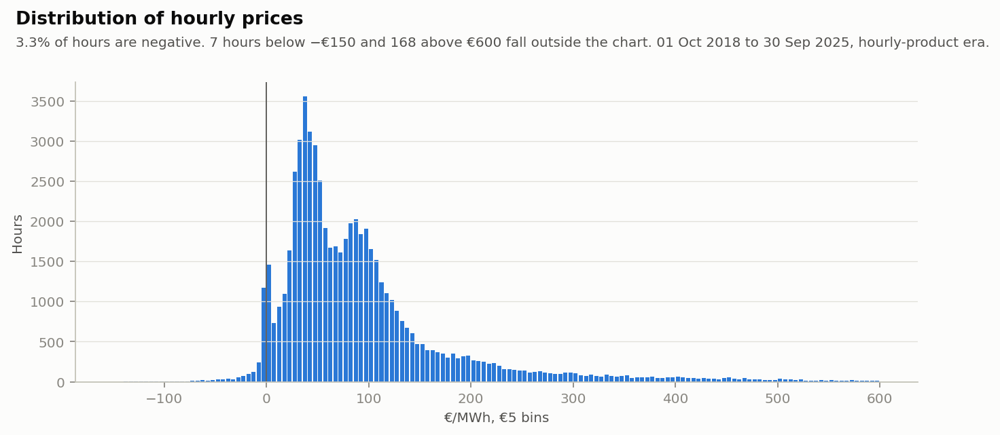
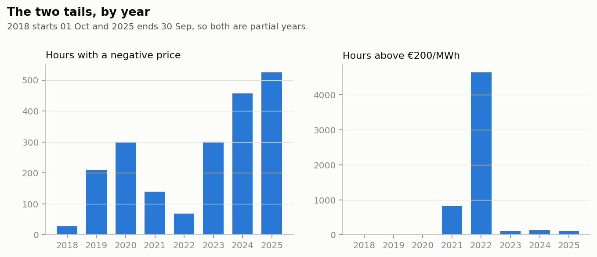
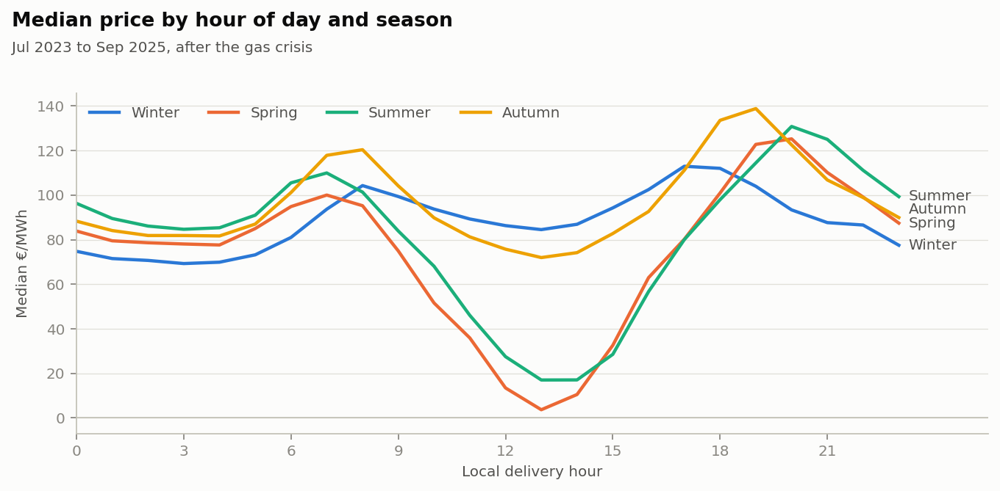
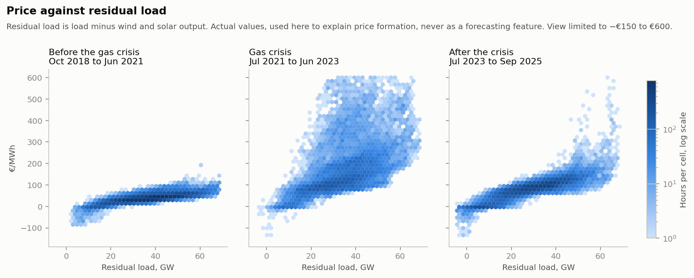

# Data guide

What the data behind this project is, column by column, what it looks like, what
can go wrong with it, and how it feeds the forecasting and trading code.

This is a living document. Each phase adds its part, so the guide always
describes the code as it is.

| Part | Status |
|---|---|
| 1 to 8: decision, source, dataset, columns, quality, what the data shows | Written in Phase 0 |
| 9: what is known at the gate | Phase 0 finding; enforced since Phases 1 and 2 |
| 10: feature engineering | Written in Phase 2 |
| 11: how the data feeds forecasting | Planned, Phases 1 and 2 |
| 12: how the data feeds trading optimization | Planned, Phases 3 and 4 |
| 13: dashboard artifacts | Planned, Phase 5 |

Every number here is reproducible. `notebooks/phase0_eda.py` writes the figures,
[summary.md](figures/phase0/summary.md) and
[data_guide_tables.md](figures/phase0/data_guide_tables.md). Unless a table says
otherwise, statistics cover the hourly-product era, 1 October 2018 to
30 September 2025, with quarter-hours averaged to hours, in local time. The
hold-out period is never analysed (§7).

---

## 1. The decision this data serves

A battery trading in the German day-ahead market makes one decision a day. By
12:00 on day D it bids for every 15-minute delivery period of day D+1. The
exchange then publishes one clearing price per quarter-hour at about 12:45. Every column in the
dataset is judged by one question: **could we have known this at 11:40 on
day D?**

| When | What happens |
|---|---|
| Day D−1, 12:45 | Prices for day D are published |
| Day D−1, 18:00 | Grid operators submit day-ahead wind and solar forecasts for day D |
| Day D, by 10:00 | Day-ahead load forecast for D+1 is due, two hours before the gate |
| Day D, 11:40 | Our forecast and dispatch plan must be ready |
| Day D, 12:00 | Gate closes for day D+1 |
| Day D, 12:45 | Prices for day D+1 are published |
| Day D, 18:00 | Day-ahead wind and solar forecasts for D+1 are submitted, **after the gate** |

The 18:00 and two-hours-before-gate deadlines come from EU Regulation 543/2013,
Articles 14(1)(d) and 6(1)(b). SMARD's forecast-data page confirms that grid
operators submit the day-ahead generation forecasts at 18:00 for the following
day.

---

## 2. Source

| | |
|---|---|
| Provider | [SMARD.de](https://www.smard.de), run by Bundesnetzagentur, Germany's energy regulator |
| Licence | CC BY 4.0. Credit line: Bundesnetzagentur \| SMARD.de |
| Access | The JSON files behind the SMARD website. No key, but not a versioned API |
| Code | `src/ingest/smard.py` downloads; `src/ingest/build_dataset.py` assembles |
| Rebuild | `uv run python -m src.ingest.build_dataset` |

**How the download works.** Each series arrives as weekly files of quarter-hour
values, cached under `data/raw/smard/`. A week counts as settled once four newer
weeks exist. Only a week that had already settled when it was downloaded is
reused; anything else is downloaded again. A full download takes about eight
minutes, a refresh about ten seconds.

**Cross-check.** Our prices matched Energy-Charts, from Fraunhofer ISE, to within
€0.01 on six test days, including both DST days and one day after the switch to
15-minute products. Energy-Charts republishes SMARD data, so this confirms our
download and time alignment, not SMARD itself.

Why SMARD instead of OPSD or ENTSO-E is recorded in
[decisions.md](decisions.md).

---

## 3. The dataset

| Property | Value |
|---|---|
| File | `data/processed/smard_quarterhour.parquet`, not committed |
| Quality report | `data/processed/smard_quarterhour_quality.json` |
| Grain | One row per 15-minute delivery period |
| Index | `timestamp_utc`: start of the period, timezone-aware UTC |
| Columns | 12: nine downloaded, two derived, one product flag |
| Coverage, build of 13 Sep 2026 | 30 Sep 2018 22:00 UTC to 14 Sep 2026 21:45 UTC, 278,976 quarter-hours |
| Tuning period | 268,800 quarter-hours, of which 23,328 carry 15-minute products |
| Hold-out so far | 10,176 quarter-hours |

**Time conventions**

- **Everything is stored in UTC.** Local time, Europe/Berlin, is used only for
  display and calendar features.
- **A delivery day is a local calendar day.** It has 92 quarter-hours on the
  last Sunday of March, 100 on the last Sunday of October and 96 otherwise. The dataset starts at 22:00 UTC
  because that is local midnight on 1 October 2018, the first day of the DE-LU
  bidding zone.
- **Periods within a day are numbered by position**, from 0, never by local
  clock time. Local 02:00 to 02:59 is missing in March and happens twice in
  October. This lives in `src/timegrid.py`.
- **The series is quarter-hourly for its whole length.** Day-ahead products
  became 15-minute for delivery from 1 October 2025. Before that the market
  traded hourly products, so those quarter-hours repeat their hour's price and
  `price_product_minutes` is 60. Load, wind and solar are genuinely
  quarter-hourly throughout.
- **Volumes are average MW.** SMARD publishes MWh per quarter-hour; the builder
  multiplies by four. Tables in this guide show GW for readability.
- **The dataset ends at the last published price.** Other columns can end
  earlier. In the build of 13 Sep 2026, prices for 14 September were already
  published but the wind and solar forecasts for that day were not, consistent
  with their 18:00 submission time, and measured values ended 34 hours before
  the last price. The quality report lists these trailing gaps.

---

## 4. Column dictionary

| Column | SMARD filter | Meaning | Kind | Known at 11:40 on day D for day D+1? |
|---|---|---|---|---|
| `price_eur_mwh` | 4169 | Day-ahead clearing price, DE-LU, €/MWh. Before 1 Oct 2025 all quarter-hours of an hour share its price | Target | No, it is what we forecast. Prices up to the end of day D are known |
| `load_actual_mw` | 410 | Total grid load, measured | Actual | No. Earlier hours of day D only, after a publication delay not yet measured |
| `load_forecast_mw` | 411 | Grid operators' day-ahead load forecast | Forecast | Likely. Due two hours before the gate, may be updated later |
| `wind_onshore_actual_mw` | 4067 | Onshore wind generation, measured | Actual | No, as for load |
| `wind_offshore_actual_mw` | 1225 | Offshore wind generation, measured | Actual | No, as for load |
| `solar_actual_mw` | 4068 | Solar generation, measured | Actual | No, as for load |
| `wind_onshore_forecast_mw` | 123 | Grid operators' day-ahead onshore wind forecast | Forecast | **No. Submitted at 18:00 on day D** |
| `wind_offshore_forecast_mw` | 3791 | Grid operators' day-ahead offshore wind forecast | Forecast | **No**, as above |
| `solar_forecast_mw` | 125 | Grid operators' day-ahead solar forecast | Forecast | **No**, as above |
| `residual_load_actual_mw` | Derived | Load minus onshore wind, offshore wind and solar, all actuals | Derived | No |
| `residual_load_forecast_mw` | Derived | The same, from the forecast columns | Derived | **No**, it inherits the renewables timing |
| `price_product_minutes` | Derived | 60 for hourly products before 1 Oct 2025, 15 for quarter-hour products after | Flag | Yes, fixed by the calendar |

**Residual load** is the demand left for conventional power plants after wind
and solar. It is the best single explanation of the price (§8.5). A residual
value is missing whenever any input is missing; a gap is never treated as zero.

### Model-input dataset

Models read `data/processed/model_inputs_quarterhour.parquet`, built by
`src/ingest/build_inputs.py`: the SMARD columns above plus these.

| Columns | Meaning | Source | Known at 11:40 on day D for day D+1? |
|---|---|---|---|
| `gas_ttf_eur_mwh` | Last Dutch TTF gas futures settlement before the row's local day, €/MWh | Yahoo Finance, TTF=F | Rows up to day D |
| `carbon_eua_eur_t` | Last EU carbon allowance auction price before the row's local day, €/t | EEX primary auctions | Rows up to day D |
| `wx_<point>_<variable>` | 36 columns: wind speed at 100 m, shortwave radiation and temperature at 12 points, forecast two days before each period | Open-Meteo Previous Runs | Yes, through day D+1 |

Weather columns are missing before March 2024, when the archive starts. The gas
ticker follows the US exchange calendar, so some European trading days repeat
the previous price, and carbon auctions pause for about three weeks each January.

---

## 5. What the values look like

### Column statistics, hourly-product era, hourly values

| column | unit | missing hours | mean | p01 | median | p99 | min | max |
|---|---|---|---|---|---|---|---|---|
| price_eur_mwh | €/MWh | 0 | 93.3 | -10.0 | 69.4 | 483.5 | -500.0 | 936.3 |
| load_actual_mw | GW | 0 | 54.8 | 36.0 | 54.7 | 74.6 | 30.9 | 81.3 |
| load_forecast_mw | GW | 24 | 54.2 | 36.2 | 54.0 | 71.4 | 30.5 | 77.6 |
| wind_onshore_actual_mw | GW | 0 | 11.8 | 0.6 | 9.1 | 39.1 | 0.0 | 48.5 |
| wind_offshore_actual_mw | GW | 0 | 2.8 | 0.0 | 2.6 | 6.5 | 0.0 | 7.9 |
| solar_actual_mw | GW | 0 | 6.2 | 0.0 | 0.2 | 37.8 | 0.0 | 52.1 |
| wind_onshore_forecast_mw | GW | 0 | 11.7 | 0.7 | 8.9 | 38.9 | 0.2 | 46.6 |
| wind_offshore_forecast_mw | GW | 0 | 2.8 | 0.1 | 2.7 | 6.2 | 0.0 | 6.8 |
| solar_forecast_mw | GW | 0 | 6.2 | 0.0 | 0.2 | 37.4 | 0.0 | 50.4 |
| residual_load_actual_mw | GW | 0 | 34.0 | 2.3 | 34.6 | 63.8 | -8.4 | 74.6 |
| residual_load_forecast_mw | GW | 24 | 33.5 | 1.2 | 34.4 | 61.6 | -14.0 | 70.2 |

- **Price** runs from −€500, the exchange's lower price limit, reached once on
  2 July 2023 at 14:00, to €936.3. The median, €69.4, sits far below the mean,
  €93.3: the distribution has a long right tail.
- **Residual load goes negative in 311 hours.** In those hours wind and solar
  alone exceeded grid load.
- **Solar's median is 0.2 GW** because about half of all hours are dark.
- **The load forecast and forecast residual miss 24 hours**, all on
  31 January 2020 (§6).

### An example day: Sunday 12 May 2024

Every second hour, local time.

| local time | price €/MWh | load GW | wind GW | solar GW | residual load GW | residual load forecast GW |
|---|---|---|---|---|---|---|
| 00:00 | 65.5 | 36.7 | 14.4 | 0.0 | 22.3 | 24.6 |
| 02:00 | 44.5 | 33.9 | 14.0 | 0.0 | 19.9 | 23.2 |
| 04:00 | 46.3 | 33.9 | 13.4 | 0.0 | 20.6 | 23.2 |
| 06:00 | 17.6 | 35.0 | 12.2 | 2.6 | 20.2 | 21.8 |
| 08:00 | 2.4 | 41.1 | 7.3 | 20.7 | 13.1 | 13.3 |
| 10:00 | -25.0 | 44.3 | 4.4 | 37.2 | 2.7 | 0.2 |
| 12:00 | -100.1 | 44.3 | 3.0 | 41.4 | -0.1 | -4.3 |
| 14:00 | -132.8 | 41.1 | 2.8 | 38.7 | -0.4 | -3.8 |
| 16:00 | -30.0 | 40.5 | 8.1 | 30.8 | 1.7 | 2.7 |
| 18:00 | 22.5 | 44.6 | 16.8 | 13.3 | 14.5 | 18.1 |
| 20:00 | 75.7 | 45.3 | 19.7 | 0.8 | 24.8 | 25.7 |
| 22:00 | 44.6 | 45.1 | 25.4 | 0.0 | 19.7 | 17.9 |

A low Sunday load meets strong sun. Solar reaches 41.4 GW at 12:00, residual
load falls to about zero from 12:00 to 14:00, and the price drops to −€132.8 at
14:00. As the sun sets, wind picks up and residual load climbs back to 24.8 GW
at 20:00, where the price is €75.7. A battery was paid to charge at midday and
could sell into the evening. The forecast residual load was 4.2 GW below the
actual at 12:00.

---

## 6. Data quality

Checks run on every build by `src/ingest/quality.py`. Structural checks decide
pass or fail. Value checks are reported only, because negative and extreme prices
are real.

| Check | What it catches | Result, build of 13 Sep 2026 |
|---|---|---|
| Resolution | Rows at a step other than 15 minutes | 15-minute throughout |
| Missing timestamps | Periods absent from the index | 0 |
| Duplicate timestamps | The same period twice | 0 |
| DST day length | Days whose row count differs from 92, 96 or 100 as the calendar requires | 0 |
| Hourly products | A pre-switch hour whose quarter-hours carry different prices | 0 |
| Column gaps | Missing values, longest gap, unpublished tail | Load forecast gap below |
| Price summary | Negative and extreme prices, reported and never failed | Recorded in the quality report |

**Known issues**

- **Load forecast gap on 31 January 2020.** SMARD has no load forecast for that
  local day, 96 quarter-hours. The fill policy is a Phase 1 decision.
- **Solar is not exactly zero at night.** See the night-time solar figures in
  [data_guide_tables.md](figures/phase0/data_guide_tables.md). The forecast is
  zero there. Harmless for price modelling, but it matters for error ratios.
- **Recent days can be missing for a while.** The build of 13 Sep 2026 had
  prices for 14 September but none for 13 September, 96 quarter-hours, while
  Energy-Charts already had them. The quality report flags such gaps, and the
  newest weeks are re-downloaded on every run, so the gap closes on a later
  refresh. For the live dashboard this is the missing-data case, D1.
- **Revisions after a week has settled are not captured.** See D2 in
  [production_notes.md](production_notes.md).
- **Forecast vintages are unknown.** SMARD publishes one value per quarter-hour, not
  the history of revisions.

### Grid-operator forecasts against actuals

Bias is forecast minus actual.

| series | mean actual GW | MAE GW | bias GW | correlation |
|---|---|---|---|---|
| Wind onshore | 11.8 | 1.09 | -0.1 | 0.987 |
| Wind offshore | 2.82 | 0.48 | 0.01 | 0.932 |
| Solar | 6.18 | 0.44 | 0.0 | 0.995 |
| Load | 54.84 | 2.08 | -0.65 | 0.965 |
| Residual load | 34.05 | 2.55 | -0.56 | 0.971 |

The configured series are the right ones: each forecast tracks its own actual
closely. The same closeness is the warning: a solar forecast that correlates 0.995 with the actual
gives a model almost everything the actual would, so using the post-gate
forecasts would be a strong leak (§9).

---

## 7. Periods and splits

| Period | Local dates | Use |
|---|---|---|
| Tuning | 1 Oct 2018 to 31 May 2026 | Exploration, feature and model design, walk-forward validation |
| Hold-out | From 1 Jun 2026 | Final test in Phase 4 only. Not explored, not tuned on |

The hold-out start was confirmed on 13 September 2026. Training keeps eight
months of genuine quarter-hour prices, October 2025 to May 2026, including the
negative-price months of April and May. The hold-out covers June to
mid-September 2026, summer only, so winter evening spikes are not tested until
it grows. The Phase 0 figures describe the hourly-product era and do not
yet cover the 15-minute months.

**Regime labels** used in the figures are descriptive, with approximate
boundaries. They are not model inputs.

| regime | local dates | hours | mean price €/MWh | rank correlation, price with residual load |
|---|---|---|---|---|
| Before the gas crisis | Oct 2018 to Jun 2021 | 24,096 | 39.5 | 0.779 |
| Gas crisis | Jul 2021 to Jun 2023 | 17,520 | 178.3 | 0.656 |
| After the crisis | Jul 2023 to Sep 2025 | 19,752 | 83.5 | 0.874 |

---

## 8. What the data shows

Each figure answers one question about price formation. Together they explain
why the forecasting and trading design looks the way it does, and they are the
first place to look when a forecast or a trade goes wrong.

### 8.1 How has the price level changed?

**What it shows:** the mean of each local day's hourly prices.

**What we see**

- 2019 and 2020 were calm, with yearly means of €37.7 and €30.5.
- Prices climbed through 2021: €55.0 in the first half, €138.0 in the second.
  2022 averaged €235.4, and the highest day was 26 August 2022 at €699.
- From 2023 the level settled, with yearly means of €95.2 in 2023, €78.5 in 2024
  and €88.0 for January to September 2025. Day-to-day swings stayed much larger
  than before 2021.

**Why it matters**

- The price is not stationary. A model trained on 2019 and 2020 saw a price
  above €200 in only one hour. This is the regime-shift experiment, M1.
- The length of the training window is a real modelling choice, tested in
  Phase 2 rather than assumed.

### 8.2 What does the distribution of hourly prices look like?

**What we see**

- 3.3% of hours are negative, and prices pile up around zero: 1,173 hours between
  −€5 and €0 and 1,457 between €0 and €5.
- The right tail is long: 168 hours above €600.
- There are two humps, around €35 to €45 and around €85 to €100. That is the calm
  years and the post-2021 years mixed in one histogram.

**Why it matters**

- MAPE is unusable: it divides by the price, which is often zero or negative.
  Forecasts are scored with pinball loss and MAE.
- The quantile model must be able to produce negative prices and a wide upper
  tail.
- A distribution pooled across regimes describes no single year well, so
  statistics are reported by year or regime.

### 8.3 How often do the two tails occur?

| year | negative hours | hours above €200 |
|---|---|---|
| 2019 | 211 | 0 |
| 2020 | 298 | 1 |
| 2021 | 139 | 823 |
| 2022 | 69 | 4,642 |
| 2023 | 301 | 112 |
| 2024 | 457 | 129 |
| 2025, Jan to Sep | 525 | 110 |

**What we see**

- Negative hours fell during the gas crisis, then reached new highs each year
  from 2023.
- Hours above €200 were common only in 2021 and 2022. Since 2023 there have been
  about 110 to 130 a year, one to two percent of hours.

**Why it matters**

- Negative hours are a battery's best charging opportunities, and there are more
  of them every year.
- Spike hours carry a large share of arbitrage value but are rare. A backtest
  needs several years to say anything reliable about spikes, and a dedicated
  spike classifier, M5, may be needed.

### 8.4 When in the day is power cheap or expensive?

**Daily shape after the crisis, median €/MWh**

| season | cheapest hour | median | dearest hour | median | dearest minus cheapest |
|---|---|---|---|---|---|
| Winter | 03:00 | 69.3 | 17:00 | 112.9 | 43.7 |
| Spring | 13:00 | 3.7 | 20:00 | 125.2 | 121.5 |
| Summer | 13:00 | 17.0 | 20:00 | 130.8 | 113.8 |
| Autumn | 13:00 | 72.0 | 19:00 | 138.8 | 66.8 |

**When the tails happen, share of each kind of hour by local time band**

| local hours | negative, before crisis | negative, after crisis | above €200, after crisis |
|---|---|---|---|
| 00:00 to 05:59 | 34% | 11% | 0% |
| 06:00 to 09:59 | 14% | 6% | 19% |
| 10:00 to 15:59 | 40% | 71% | 11% |
| 16:00 to 19:59 | 8% | 11% | 48% |
| 20:00 to 23:59 | 4% | 1% | 22% |

**What we see**

- Spring and summer have a deep midday valley from solar and a peak at 20:00.
- Autumn has the highest evening peak; winter is the flattest, peaking at 17:00
  after an early sunset.
- Before the crisis a third of negative hours came at night, when wind is the
  only renewable running.
  After the crisis 71% fall between 10:00 and 15:59: negative prices have become
  a solar phenomenon.
- Hours above €200 cluster on the evening ramp, 16:00 to 19:59.

**Why it matters**

- This is the trade: charge in the midday valley, discharge on the evening ramp.
- Hour-of-day by season is a core feature interaction.
- Forecast errors on the evening ramp are the expensive ones; errors at 03:00
  barely matter. This is the error-asymmetry analysis, T1.

**Daily spread, €/MWh**

| year | mean highest minus lowest hour | mean top-2 minus bottom-2 hours |
|---|---|---|
| 2019 | 30.1 | 28.3 |
| 2020 | 32.5 | 30.0 |
| 2021 | 80.3 | 75.6 |
| 2022 | 187.0 | 177.2 |
| 2023 | 97.9 | 91.7 |
| 2024 | 111.2 | 103.8 |
| 2025, Jan to Sep | 137.3 | 128.3 |

The top-2 minus bottom-2 spread is the gross opportunity for a two-hour battery,
before efficiency losses and degradation. It is more than four times larger
than in 2019 and still rising after the crisis.

### 8.5 How does residual load set the price?

**Median price by residual load, €/MWh.** Bands include their upper edge.

| residual load GW | before crisis | gas crisis | after crisis | after crisis, p90 | after crisis, hours |
|---|---|---|---|---|---|
| -20 to 0 | no hours | -8.8 | -11.6 | -0.0 | 300 |
| 0 to 10 | -11.2 | 4.4 | 0.0 | 25.4 | 1,747 |
| 10 to 20 | 8.5 | 64.8 | 46.5 | 76.9 | 3,115 |
| 20 to 30 | 27.9 | 103.0 | 80.2 | 99.6 | 4,681 |
| 30 to 40 | 36.2 | 146.3 | 98.3 | 121.0 | 5,319 |
| 40 to 50 | 45.3 | 197.8 | 121.0 | 152.9 | 3,220 |
| 50 to 60 | 55.2 | 237.4 | 146.5 | 203.3 | 1,092 |
| 60 to 80 | 71.9 | 317.3 | 189.5 | 382.4 | 278 |

**What we see**

- This is the merit order in data. The more demand is left after wind and solar,
  the more expensive the last power plant needed.
- Before the crisis the curve was flat and tight: roughly €10 to €20 more per
  10 GW.
- During the crisis the same residual load cost about four times as much above
  20 GW, and the spread was wide. Gas set the price, and gas was expensive and volatile.
- After the crisis the curve is steeper than before and bends up sharply at the
  top. The 90th percentile nearly doubles from the 50 to 60 GW band to the 60 to
  80 GW band.
- Below 10 GW of residual load the median price is near or below zero in every
  regime.

**Why it matters**

- Residual load is the master feature, but only a gate-available estimate of it
  can be used (§9).
- The mapping from residual load to price moves with fuel costs. That is why gas
  and carbon prices are planned features and why retraining cadence matters.
- The bands where the 90th percentile jumps are where quantile forecasts must
  widen. Getting that right is what calibration means in practice.

---

## 9. What is known at the gate

Feature eligibility as currently established. Phase 2 turns this into enforced
rules with tests.

| Information | Known at 11:40 on day D for day D+1? | Basis |
|---|---|---|
| Prices up to the end of day D | Yes | Published 12:45 on day D−1 |
| Measured load, wind and solar for earlier hours of day D | Partly | Publication delay not yet measured |
| Grid operators' load forecast for D+1 | Likely | Due two hours before the gate; updates and vintages unknown |
| Grid operators' wind and solar forecasts for D+1 | **No** | Submitted 18:00 on day D |
| Grid operators' wind and solar forecasts for day D | Yes | Submitted 18:00 on day D−1 |
| Calendar: hour, weekday, holidays, DST | Yes | Deterministic |
| Gas settlements and carbon auction prices up to day D−1 | Yes | Ingested in Phase 2 |
| Weather forecasts issued two days before each period of day D+1 | Yes | Open-Meteo archive from March 2024; fresher values masked at download |

**Consequence.** The dataset's renewable forecast columns, and the forecast
residual load built from them, describe day D+1 with information that arrives
six hours after the gate. They stay in the dataset for analysis and for the
leakage experiment M3, but no reported model may use them for day D+1. The
options are recorded in [decisions.md](decisions.md).

---

## 10. Feature engineering

*Written in Phase 2.* `src/features/build.py` builds features from the
information set only. For a delivery period on day X, every feature uses data
published by 11:40 on day X−1. `tests/test_features.py` builds features from a
day's information set and requires them to equal features built from the full
dataset.

| Group | Features | Built from | Known because |
|---|---|---|---|
| Calendar | Clock time, weekday, weekend, national holiday, day of year as sine and cosine, periods in the day, product type | The delivery calendar | Fixed in advance |
| Price history | Price at the same local clock time 1, 2 and 7 days earlier; the 7-day mean at that time; mean, minimum, maximum, spread and last price of day X−1 | `price_eur_mwh` | Prices up to day X−1 are published |
| Load | Load forecast, its daily mean, its change from the same time a day earlier | `load_forecast_mw` | Due two hours before the gate |
| Grid-operator forecasts | Onshore wind, offshore wind and solar forecasts for day X−1 at the same clock time; the load forecast minus those | The forecast columns | Day X−1 forecasts arrived at 18:00 on X−2 |
| Measured | Mean measured wind, solar and load over the 24 hours before the publication cutoff | The measured columns | The cutoff is three hours before issue |
| Weather | Mean wind speed onshore and offshore, output share on a generic turbine curve, mean radiation overall and in the south, mean temperature | The 36 `wx_` columns | Forecasts issued two days ahead |
| Fuels | Gas and carbon prices, and the marginal cost of a gas plant | The fuel columns | Last prices published before day X−1 |

"Same local clock time" handles DST: the day after the spring change uses 01:45
for its 02:00 to 02:45 periods, and the repeated autumn hour keeps its first
value.

**Incomplete inputs give missing features, never partial averages.** A weather
average needs every point, a 24-hour measured average needs every period, and
statistics of day X−1 need the complete day. Tree models handle the missing
values; the linear model fills them with training medians.

The turbine curve is a generic stand-in: no output below 3 m/s, rising with the
cube of wind speed to full output at 12 m/s, and none above 25 m/s. The gas
plant's marginal cost assumes 55% efficiency and 0.202 tonnes of CO2 per MWh of
gas burned.

## 11. How the data feeds forecasting

*Written in Phases 1 and 2.*

- **Target:** `price_eur_mwh` for every 15-minute period of day D+1, at seven
  quantiles, q05 to q95.
- **Input:** only the information set, the dataset with every cell removed that
  was not published at 11:40 on day D (§9). Columns without a publication rule
  are refused.
- **Baselines:** the price at the same local clock time on day D, and one week
  before day D+1. Their ranges come from their own errors over the last 28 days,
  per local hour.
- **Gaps:** a missing source day falls back to a longer lag, then to the last
  published price. Those periods take their range from the longer lag's errors,
  which are wider. With fewer than 14 days of past errors a baseline refuses to
  forecast instead of showing a precise-looking range. Missing actual prices
  are skipped in scoring and counted.
- **Output:** one row per period with the quantile columns, the target day,
  fallback and quantile-crossing counts, the actual price and the product type.
- **Evaluation:** walk-forward over training days, scored overall, on the
  validation window from 1 June 2024, on 15-minute products, on negative-price
  days and on days above €200. Results:
  [phase1_baselines.md](results/phase1_baselines.md).
- **Models compared in Phase 2:** LEAR-style linear model, LightGBM quantile,
  LightGBM with conformal ranges, quantile regression forest, MSTL and QRA, over
  the validation window 1 June 2024 to 31 May 2026. The comparison and the reasons
  for the choice are in `notebooks/model_comparison.ipynb`.
- **Production model: LightGBM with conformal ranges.** It trains on two years of
  features, was refit every 28 days in the comparison, retrains on every
  production run, and sizes each hour's range from its errors on
  the last 42 training days. Over the validation window its mean pinball loss is
  5.11, 46.8% below the naive baseline, and its 90% range covers 85.6% of prices.
  `src/forecasting/production.py` runs it for one day.

## 12. How the data feeds trading optimization

*Planned, Phases 3 and 4.* Inputs: the quantile forecasts for day D+1, realised
prices for settlement and the perfect-foresight benchmark, and battery parameters
from `config/settings.yaml`. This section will document how each input enters the
optimization and how profit and loss is attributed back to forecast errors.

## 13. Dashboard artifacts

*Planned, Phase 5.* The files the backtest writes for the dashboard, and which
panel reads each one.

---

## Changelog

| Date | Phase | Change |
|---|---|---|
| 2026-09-13 | 0 | First version: decision timeline, source, dataset, columns, quality, five figures, gate availability |
| 2026-09-13 | 0 | Dataset switched to 15-minute periods, volumes in MW, product flag added |
| 2026-09-13 | 0 | Hold-out start confirmed as 1 Jun 2026 |
| 2026-09-13 | 1 | Section 11: forecasting inputs, baselines, gaps, output and evaluation |
| 2026-09-13 | 2 | Model-input dataset, gate rows for weather and fuels, section 10 features |
| 2026-09-13 | 2 | Section 11: candidate models and the production model |
